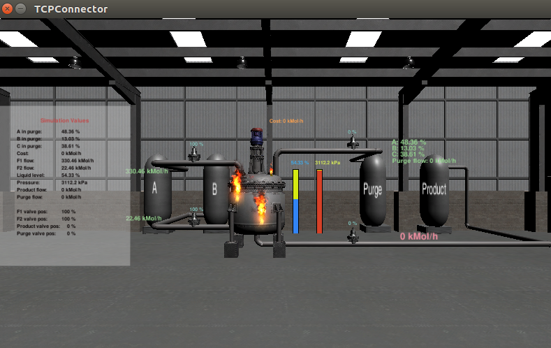
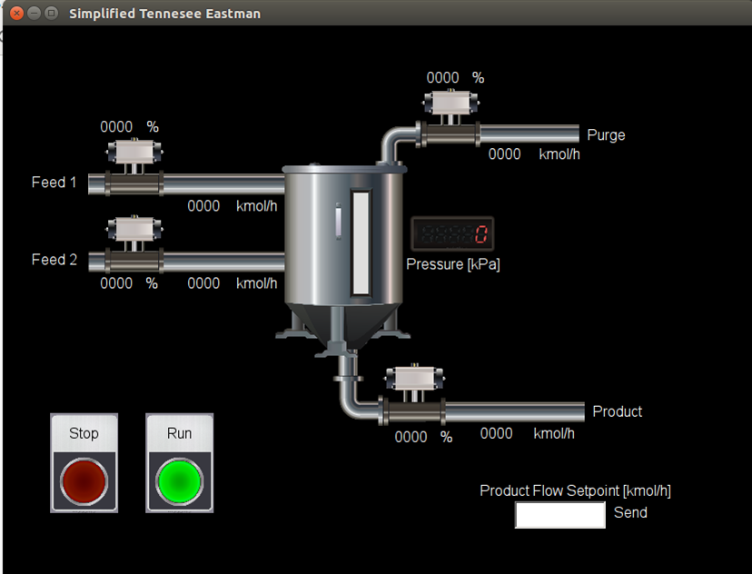

# GRFICS
GRFICS is a graphical realism framework for industrial control simulations that uses Unity 3D game engine graphics to lower the barrier to entry for industrial control system security. GRFICS provides users with a full virtual industrial control system (ICS) network to practice common attacks including command injection, man-in-the-middle, and buffer overflows, and visually see the impact of their attacks in the 3D visualization. Users can also practice their defensive skills by properly segmenting the network with strong firewall rules, or writing intrusion detection rules.

GRFICS was originally developed by researchers from [Fortiphyd Logic](https://fortiphyd.com) and the [Georgia Institute of Technology](http://cap.ece.gatech.edu) with the goal of bringing practical ICS security skills to a wider audience. We kindly ask that any derivations or publications resulting from the use of GRFICS provide a citation for this GitHub respository and the workshop paper we published about the framework:

Formby, D., Rad, M., and Beyah, R. Lowering the Barriers to Industrial Control System Security with GRFICS. In *2018 USENIX Workshop on Advances in Security Education (ASE 18)*. https://www.usenix.org/conference/ase18/presentation/formby

### Overview

The current version of GRFICS is organized as 3 VirtualBox VMs (a 3D simulation, a soft PLC, and an HMI) communicating with each other on a host-only virtual network. For a more detailed explanation of the entire framework and some background information on ICS networks, please refer to the workshop paper located at https://www.usenix.org/conference/ase18/presentation/formby

### Simulation

The simulation VM runs a realistic simulation of a chemical process reaction that is controlled and monitored by simulated remote IO devices through a simple JSON API. These remote IO devices are then monitored and controlled by the PLC VM using the Modbus protocol.

### Programmable Logic Controller

The PLC VM is a modified version of OpenPLC (https://github.com/thiagoralves/OpenPLC_v2) that uses an older version of the libmodbus library with known buffer overflow vulnerabilities. 

### Human Machine Interface

The HMI VM primarily contains an operator HMI created using the free AdvancedHMI (https://www.advancedhmi.com) software. This HMI is used to monitor the process measurements being collected by the PLC and send commands to the PLC.

In addition to the HMI, this VM also contains the PLCOpenEditor software used to reprogram the OpenPLC.

### Instructions

Recommended hardware:

25GB free hard drive space

8GB RAM

Quad core processor

You can either install from scratch or download pre-built VMs from my Google Drive. 

#### Installing from scratch

1. Download and install the latest version of VirtualBox from https://www.virtualbox.org/wiki/Downloads

2. Create a host-only interface in VirtualBox (https://www.virtualbox.org/manual/ch06.html#network_hostonly)

3. Download an image for both the desktop and server versions of 64-bit Ubuntu 16.04 from http://releases.ubuntu.com/16.04/

4. See instructions for each VM in corresponding directories

#### Pre-built VMs

1. Download VMs:

PLC VM (MD5 checksum 1ac605177bb81a64b500a8a203edfbe6):

https://drive.google.com/open?id=1M3yRafNxwBEkDcTw-53tJ32U1BTV0RMt

Simulation VM (MD5 checksum e59b65222d9da143fe13118635caa1d5):

https://drive.google.com/open?id=1ZN7u_WPUGHsEeos09NITpLImbeU9LKpI

HMI VM (MD5 checksum 6c27e87c742d75580c1bd05119e0d348):

https://drive.google.com/open?id=1MJpiA-yt89xgTCYVJocddhE4_OUvvWG4

2. Add a host-only adapter in VirtualBox with IP address 192.168.95.1 and 255.255.255.0 netmask (https://www.virtualbox.org/manual/ch06.html#network_hostonly)

3. Import each VM into VirtualBox using File->Import Appliance

4. Every VM can be logged into with username "user" and password "password"

5. Log into the simulation VM and open 2 terminals. In one, cd into the "HMI_Simulation_Ubuntu1604_15_x86_64" directory and run "sudo ./HMI_Simulation_Ubuntu1604_15_x86_64.x86_64". 
Enter "/home/user/simulation/simulation" for the path to the simulation code, click "Run Server" and then click "Start". 
In the second terminal, cd into the simulation/remote_io directory and run "sudo bash run_all.sh"

6. Log into plc VM, cd into the OpenPLC_v2 directory, and run "sudo nodejs server.js"

7. Log into hmi VM, cd into the HMI directory, and run "wine HMI/AdvancedHMI.exe"

### Copyright and Licensing Description

AdvancedHMI and OpenPLC were both originally released under the GPL license and as such, we provide our modifications and source under GPL as well.

We also provide our own backend simulation and remote IO code under the GPL license, but can only provide the compiled Unity executable due to the licensing requirements of the 3D models.

### Questions and Suggestions

Please contact David Formby at dformby@fortiphyd.com for any questions or suggestions.
